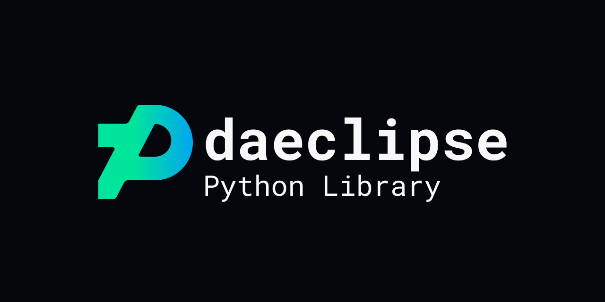

# daeclipse

[](https://pypi.org/project/daeclipse/) [](https://pypi.org/project/daeclipse/) [](https://github.com/Pepper-Wood/daeclipse/blob/main/LICENSE)

[daeclipse](https://pypi.org/project/daeclipse/) is a reverse-engineered Python library for DeviantArt Eclipse functionality.

Also check out [daeclipse-cli](https://github.com/Pepper-Wood/daeclipse-cli), a handy CLI to bundle `daeclipse` capabilities.

## Installation

The Python library is available via https://pypi.org/project/daeclipse/

```bash
pip install daeclipse
```

## Usage

```py
import daeclipse

# Fetches a list of group names the user is a member of.
# You will need to be logged into DeviantArt and have a chrome page open.
eclipse = daeclipse.Eclipse()
groups, has_more, next_offset, total = eclipse.get_groups("Pepper-Wood", 0)
for group in groups:
    print(group.username)
```

For more examples, see the [code snippets within the daeclipse-cli commands](https://github.com/Pepper-Wood/daeclipse-cli/tree/main/daeclipse_cli/commands).

## Build Status and Checks

CICD is run thorugh GitHub Actions and makes the below checks on the two components of this repository:

| | Python Package | OpenAPI Spec |
| --- | --- | --- |
| Lint |  |  |
| Test | Coming Soon... | Coming soon... |
| Deploy |  |  |

## Contributing

Contributions are always welcome, no matter how large or small! Before contributing, please read the [code of conduct](CODE_OF_CONDUCT.md).

[](CODE_OF_CONDUCT.md)

If you have a feature request, run into a bug, or are unsure about anything, feel free to submit a GitHub issue.

If you are interested in creating a Pull Request, please read the [guide on this repository's development process](docs/development.md).

Commit titles on the `main` branch follow the [emoji-commit-messages](https://github.com/cooperka/emoji-commit-messages) naming convention.

## Caveats / Disclaimer

DeviantArt's history as a website is storied. Prior to the release of Eclipse, there were two options with creating tooling around its UI:
- The [Public DeviantArt API](https://www.deviantart.com/developers/). See [accompanying Python wrapper](https://pypi.org/project/deviantart/). The API is relatively easy to use - and utilizes OAuth2 for authentication - but its endpoints and functionality are sparce. It also was not updated for some time but now appears to be getting a handful of new endpoints based on the changelog.
- The internal [DeviantArt Interactive Fragment Interface (DiFi)](https://github.com/danopia/deviantart-difi/wiki). DiFi has a wide range of functionality but is volatile/unreliable and difficult to use - especially compared to modern APIs.

On October 2019, DeviantArt announced [DeviantArt Eclipse](https://www.deviantart.com/team/journal/DeviantArt-Eclipse-is-Here-814629875), a new UI (mostly) built in React. There are still a handful of pages on the website that expose the old website (i.e. https://www.deviantart.com/groups/) where functionality hasn't been completely ported. But with the new React UI, DeviantArt brought along a third option for tooling:
- The internal **DeviantArt NAPI**, currently undocumented. The structure of its endpoints resembles RESTful practices, and authentication is done through scraping a CSRF token on the website or using a user's stored `.deviantart.com` cookies.

The implementation in this library relies on the DeviantArt NAPI. As such, functionality may break without warning depending on whether the internal DeviantArt team makes changes to these endpoints.
