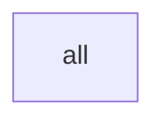
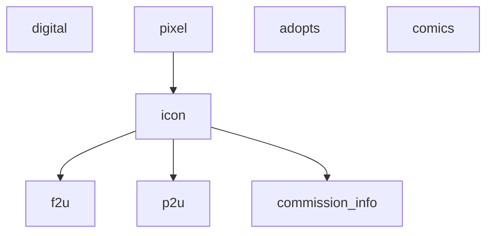
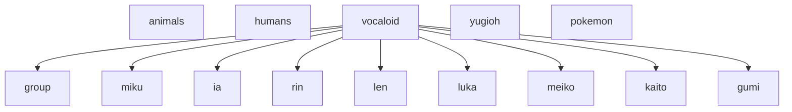

Maybe this is too complicated. What if the list just gets simplified as a list of checkboxes: select all that apply. And then that decides the flags.

----
`all` is a default True flag.
Each artwork has a `media` and a `subject`. Choosing a deeper selection means that the parent categories get inherited.

For example, a `f2u icon of Miku` will result in the categories list, `f2u > icon > pixel, miku > vocaloid, all`.

### All

### Media

### Subject

